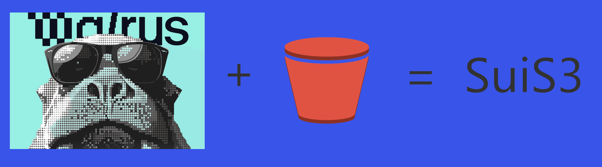

SuiS3
---

Sui Walrus provides efficient and robust decentralized storage. Basically it maintains a mapping from blob id to content, i.e. a flat namespace structure. The flat storage model presents challenges in terms of human usability and management. 
SuiS3 is a tool that presents an AWS S3-style CLI, facilitating the effective management of Walrus' flat data storage in a structured and meaningful hierarchy, through the related metadata stored on Sui. 

### How to use
#### shell mode
- execute `suis3` will into shell mode, and with `help` command, you can see all the commands.
#### command mode
- example: `suis3 ls`

### Command List

#### Table 1: List commands will send single http request
| COMMAND                                                                   | FUNCTION                                                    
|---------------------------------------------------------------------------|-------------------------------------------------------------
| mb suis3://_bucket_                                                       | create bucket
| rb suis3://_bucket_                                                       | delete bucket
| la/ls                                                                     | list all buckets
| ll                                                                        | list all buckts details (create time, bucket name)
| ls suis3://_bucket_                                                       | list objects in the bucket
| ll suis3://_bucket_                                                       | list objects detail in the bucket (object uri, create/modify time, size, blob id, expire epoch) 
| put <file> suis3://_bucket_/_object_                                      | upload the file 
| put <file> suis3://_bucket_                                               | upload the file (file name as object name)
| get suis3://_bucket_/_object_ _file_                                      | download object and save to assigned file
| get suis3://_bucket_/_object_                                             | download object in current folder
| cat suis3://_bucket_/_object_                                             | show the object content
| del suis3://_bucket_/_object_                                             | delete the object
| tag list suis3://_bucket_[/_object_]                                      | list tag(s) of the bucket or the object
| tag ls suis3://_bucket_[/_object_]                                        | list tag(s) of the bucket or the object
| tag add suis3://_bucket_[/_object_] _key1_=_value1_ [_key2_=_value2_] ... | add tag(s) to the bucket or the object
| tag put suis3://_bucket_[/_object_] _key1_=_value1_ [_key2_=_value2_] ... | add tag(s) to the bucket or the object
| tag del suis3://_bucket_[/_object_]                                       | remove tag(s) from the bucket or the object
| tag rm suis3://_bucket_[/_object_]                                        | remove tag(s) from the bucket or the object

### Demo
- pitch [slides]()
- A short demo [video]()

